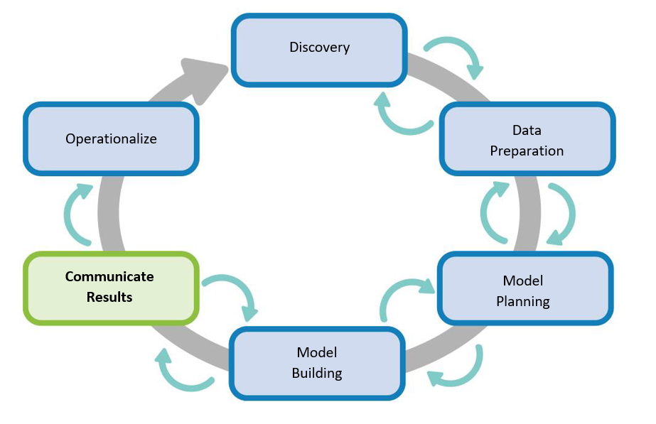

# Communicate Results
<p align = "center">

</p>

# Desired Situation

In this desired situation as shown in the above figure, now an extra phase or step is being added which is <b>“Data Science Model”</b> which is also known as <b>“Used Car Price Prediction System”</b>. Here, rather than entering vague price of the car, the users can get an estimated price predicted by the system and then they can use the generated price for the online application. Now in the data science model, the user must enter all the features of their car and then get the predicted price. The users can now trust the price generated by the system and end up not getting disappointed. With the help of predicted price by the model, the both the users can buy/sell their cars online or offline.
<p align = "center">
\
</p>

# Results
The Random Forest Regression model shown below is trained and tested well. The test set contains the examples that the learning algorithm has never seen before, so if our model performs well on predicting the labels of the examples from the test set, we can say that our model generalizes well or, simply, that it’s good. All the parameters were chosen from the grid search cv results.

```
from sklearn.ensemble import RandomForestRegressor
start_time = time.time()               

rfr = RandomForestRegressor(max_depth= 16, max_features=10, min_samples_leaf=2, n_estimators=350).fit(X_train, y_train)
pred = rfr.predict(X_test)
print(r2_score(y_test, pred)* 100)
print("--- %s seconds ---" % (time.time() - start_time))           

86.020619788918
--- 40.58843374252319 seconds ---

```

## Mean Squared Error

Mean squared error is a risk metric corresponding to the expected valueof the squared (quadratic) error or loss 

```
print("Mean Absolute Error is :", mean_absolute_error(y_test, pred))

Mean Absolute Error is : 1108.9950075720315
```

### Mean Mean  absolute  error

Mean  absolute  error  is  the  risk  metric  corresponding  to  the  expectedvalue of the absolute loss

```
print("Mean Squared Error is :", mean_squared_error(y_test, pred))

Mean Squared Error is : 2702543.7524787914
```
Below is the summarised table of performance metrics

| Model        | Accuracy          | MSE  | MAE | Time (seconds) |
| ------------- |:-------------:| -----:|
| Random forest Regressor    | 86.02061 |2697919.9154302 | 108.0748354 | 39.57201 |
