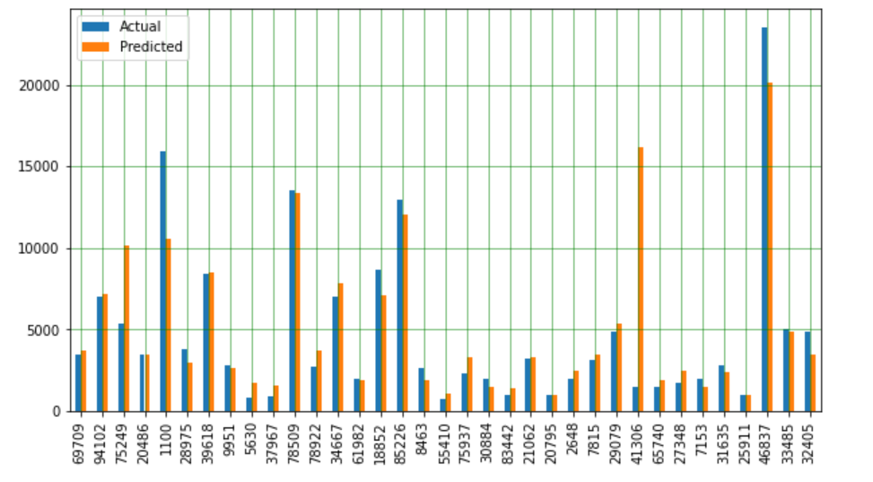
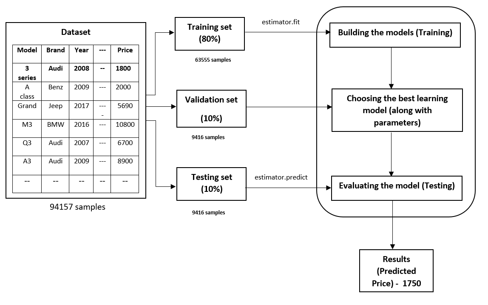

# Communicate Results
<p align = "center">

</p>

# Desired Situation

In this desired situation as shown in the above figure, now an extra phase or step is being added which is <b>“Data Science Model”</b> which is also known as <b>“Used Car Price Prediction System”</b>. Here, rather than entering vague price of the car, the users can get an estimated price predicted by the system and then they can use the generated price for the online application. Now in the data science model, the user must enter all the features of their car and then get the predicted price. The users can now trust the price generated by the system and end up not getting disappointed. With the help of predicted price by the model, the both the users can buy/sell their cars online or offline.
<p align = "center">
\
</p>

# Results
The Random Forest Regression model shown below is trained and tested well. The test set contains the examples that the learning algorithm has never seen before, so if our model performs well on predicting the labels of the examples from the test set, we can say that our model generalizes well or, simply, that it’s good. All the parameters were chosen from the grid search cv results.

```
from sklearn.ensemble import RandomForestRegressor
start_time = time.time()               

rfr = RandomForestRegressor(max_depth= 16, max_features=10, min_samples_leaf=2, n_estimators=350).fit(X_train, y_train)
pred = rfr.predict(X_test)
print(r2_score(y_test, pred)* 100)
print("--- %s seconds ---" % (time.time() - start_time))           

86.020619788918
--- 40.58843374252319 seconds ---

```

## Mean Squared Error

Mean squared error is a risk metric corresponding to the expected valueof the squared (quadratic) error or loss 

```
print("Mean Absolute Error is :", mean_absolute_error(y_test, pred))

Mean Absolute Error is : 1108.9950075720315
```

### Mean Mean  absolute  error

Mean  absolute  error  is  the  risk  metric  corresponding  to  the  expectedvalue of the absolute loss

```
print("Mean Squared Error is :", mean_squared_error(y_test, pred))

Mean Squared Error is : 2702543.7524787914
```
Below is the summarised table of performance metrics. There were four other model that were implemented but out of which only Random Forest Regression gave exceptional results. Details of the model can be found in my [Report](https://github.com/Tanu-N-Prabhu/UsedCarPricePredictionSystem-Files/blob/master/Communicate%20Results/Data_Science_Final_Report.pdf)

| Model        | Accuracy          | MSE  | MAE | Time (seconds) |
| ------------- |:-------------:| :-------------:|:-------------:| -----:|
| Random forest Regressor    | 86.02061 |2697919.9154302 | 108.0748354 | 39.57201 |


## Comparison of the predicted values with existing values

Below is the comparison between the predicted values vs the actual values. There is no much of a difference as seen in the plot below:

```
df1 = df.head(35)
df1.plot(kind='bar',figsize=(10,5.5))
plt.grid(which='major', linestyle='-', linewidth='0.5', color='green')
plt.grid(which='minor', linestyle=':', linewidth='0.5', color='black')
plt.show()
```

<p align = "center">

  </p>


## Solution Overview

Since this category of the data set falls under supervised machine learning algorithm, the regression estimator was applied on this dataset. As seen above out of the four regression algorithms namely: Linear Regression, Decision Tree Regression, Random Forest Regression and Support Vector Regression, the Random Forest Regression gave better results in terms of prediction accuracy, mean squared error and mean absolute error. More details of the performance can be found in the above chapter 5 under model performance assessment. Before applying the regression algorithms,  the correlation between two variables (independent and dependent variables) were detected and then the dependent variables which are the price of the used car was later predicted. Basically, the categorization of the variables which is the dependent are the price and the independent variables are the features of the used car except the price was done in this stage. And then the regression algorithms were applied until a good accuracy score which was presentable. In this case, Random Forest Regression gave an accuracy score of around 86.019%.

<p align = "center">
  
  </p>
  
  
  ## Next steps and recomendations
  
  Below are some of the next steps and recommendations given, this was not inculcated dud to shortage of time.
  
  * Currently the application has limited car models and brands. Because since there are more than 5000 different models and 50 different car brands adding altogether was time consuming. In the future all those and the new models will be added.
  
  * The UI will be made more still more functional by adding a user profile option such as "Login" and "Sign-up"
  
  * Currently there is no data base involved in storing the data. As an update all the vital information such as the price details would be stored in the data base, such that a user can access it whenever they want. This feature would be added in the upcoming days.
