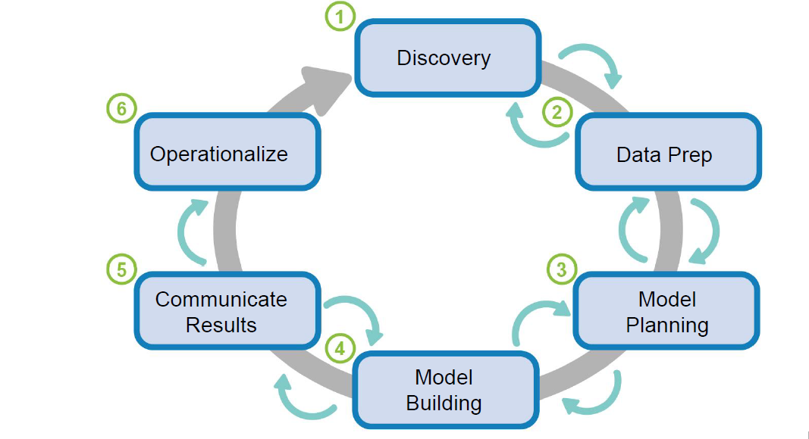

# Documentation (with full screenshots)

  
  

## Data Analytic Life Cycle

Data Science is an emerging interdisciplinary field. Altogether, data science is the science involved in studying the data. Data Analysis which is a part of data science has a life cycle composed of 6 phases. These phases include: Discovery, Data Preparation, Model Planning, Model Building, Communicate Results and Operationalize. The detailed data analytic life cycle can be found below:

This project completely follows the data analytic life cycle. All the 6 phases can be seen above. These phases must be thoroughly understood by all the executives, engineers and analysts before moving to the user guide.

1. Discovery: In this phase the introduction followed by problem statement along with the current situation and the desired situation was drafted. All this detailed information can be found [here](https://github.com/Tanu-N-Prabhu/UsedCarPricePredictionSystem-Files/blob/master/Discovery.ipynb).

2. Data Preparation: In this step all the necessary steps taken to prepare the data such as extraction,transformation,  loading  the  data  would  be  performed.   Further  the  data  was  be explored and conditioned by visualizing the results. The details of the data preparation can be found [here](https://github.com/Tanu-N-Prabhu/UsedCarPricePredictionSystem-Files/blob/master/Data_Preparation.ipynb)

Shown below is the data set and its details.

3. Model Planning: In this phase all the variables were selected by performing the Chi-squared test and heat maps were used to select the most important variables. Also the model selection, category of techniques were performed. For more details visit [here] (https://github.com/Tanu-N-Prabhu/UsedCarPricePredictionSystem-Files/blob/master/Model_Planning.ipynb)

4. Model Building: In this phase splitting the data sets into 3 sets, choosing the model, checking for overfitting and underfitting conditions and the hyperparameter tuning were performed. For more details visit [here](https://github.com/Tanu-N-Prabhu/UsedCarPricePredictionSystem-Files/blob/master/Model_Building.ipynb)

5. Communicate Results: In this phase all the findings, necessary steps to enhance the model along with the technical documentation, tool and users of the application was discussed. For more details visit [here](https://github.com/Tanu-N-Prabhu/UsedCarPricePredictionSystem-Files/tree/master/Communicate\%20Results)

6. Operationalize: In this phase the django web application was built to predict the price was built. All the process details was given along  with elucidating the prominent features and working of the application. For more details visit [here](https://github.com/Tanu-N-Prabhu/UsedCarPricePredictionSystem-Files/tree/master/Operationalize/Django\%20Application)

## Source Code User Guide for Engineers and Analysts

### Prerequisites
Below are some of the basic prerequisites that must be followed or being aware of:

1. Required Hardware Configuration: You don't need a computer with super-high specifications to run this project. But the higher the better. For example my system specifications is as shown below. Make sure your system meets these requirements. Keep your RAM as free as you can. 

After having a look at the specifications it's now time to run the code. Follow the steps below for successful execution

1. Install Jupyter Notebook or Google Colab. If the code takes a lot of time to execute in Google Colab then user Jupyter Notebook instead. 

 

Below are the download links

1. Jupyter Notebook: [Download](https://jupyter.org/install) or run this on your command prompt `pip install notebook`

Congratulations, you have installed Jupyter Notebook! To run the notebook, run the following command at the Terminal (Mac/Linux) or Command Prompt (Windows) `jupyter notebook`

2. Google Colab:[Download](https://colab.research.google.com/). Here you can open, upload or create a new notebook.
 
 
3. Clone or download my GitHub repository manually or from the command line. 

(Clone): [https://github.com/Tanu-N-Prabhu/UsedCarPricePredictionSystem-Files.git](https://github.com/Tanu-N-Prabhu/UsedCarPricePredictionSystem-Files.git)
        
        

Below are the folders that you can have a look after you clone or download

4. Navigate to the cloned folder from your command prompt using the following command:

`cd UsedCarPricePredictionSystem-Files-master`

Also, install all the required libraries and dependencies from the [requirements.txt file](https://github.com/Tanu-N-Prabhu/Used_Car_Price_Prediction_System1/blob/master/requirements.txt). You can do this using pip install command `pip install -r requirements.txt`

5. Open the individual jypyter notebook (.ipynb) on Jupyter notebook or Google colab. And then start running each and every cell. You can manually open and load all the notebooks on Google Colab. But to open specific notebooks in Jupyter Notebooks use: `jupyter notebook notebook.ipynb`

The jupyter notebook file in this case would be [Data Discovery](https://github.com/Tanu-N-Prabhu/UsedCarPricePredictionSystem-Files/blob/master/Discovery.ipynb),[Data Preparation](https://github.com/Tanu-N-Prabhu/UsedCarPricePredictionSystem-Files/blob/master/Data_Preparation.ipynb), [Model Planning](https://github.com/Tanu-N-Prabhu/UsedCarPricePredictionSystem-Files/blob/master/Model_Planning.ipynb), [Model Building](https://github.com/Tanu-N-Prabhu/UsedCarPricePredictionSystem-Files/blob/master/Model_Building.ipynb), [Model Saving](https://github.com/Tanu-N-Prabhu/UsedCarPricePredictionSystem-Files/blob/master/Model_Saving.ipynb), [Random Forest Manual Tuning of Parameters](https://github.com/Tanu-N-Prabhu/UsedCarPricePredictionSystem-Files/blob/master/Random_Forest_Manual_tuning_of_parameters.ipynb), [Random Forest Using Grid Search CV](https://github.com/Tanu-N-Prabhu/UsedCarPricePredictionSystem-Files/blob/master/Random_Forest_Using_Grid_Search_CV.ipynb).

## Data Set Preparation

Here the data set was not created from the scratch. The data-set was retrieved from [data.world](https://data.world/data-society/used-cars-data). Then all the splitting of data was done as shown below:

1. To access the raw data set please visit [here](https://drive.google.com/open?id=10uHx8frC71x5cpAPEcyUwjRzW5fJe4GU). Since the raw data set was very larger I stored it in my drive. First please all the four sets of data sets from my repository and store it on your google drive. 

  1. Raw Data set: Download [here](https://drive.google.com/open?id=10uHx8frC71x5cpAPEcyUwjRzW5fJe4GU)
  
  2. Cleaned Data Set: Download [here]({https://github.com/Tanu-N-Prabhu/UsedCarPricePredictionSystem-Files/tree/master/Cleaned\%20Dataset)
        
  3. Training Data Set: Download [here](https://github.com/Tanu-N-Prabhu/UsedCarPricePredictionSystem-Files/tree/master/Testing\%20set)
  
  4. Testing Data Set: Download [here](https://github.com/Tanu-N-Prabhu/UsedCarPricePredictionSystem-Files/tree/master/Testing\%20set)
        
  5. Validation Data Set: Download [here](https://github.com/Tanu-N-Prabhu/UsedCarPricePredictionSystem-Files/tree/master/Validation\%20set)
  
 After downloading all the data set, don't forget to mount your drive from Google Colab and then you will need to provide a access key which will be prompted on your screen. 
 

        
For any data set to covert and load it as a pandas data frame please use the following code.

        

